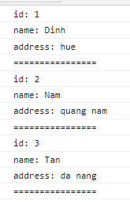

# BÀI TẬP VÒNG LẶP

## Bài 1: Viết chương trình tính tổng các số từ 1 đến 10

## Bài 2: Viết chương trình tính tổng các số chẵn từ 1 đến 10

## Bài 3: Viết chương trình in ra các số là bội của 3 trong khoảng từ 1 đến 50

## Bài 4: Viết chương trình nhập 2 số a, b (a < b). In ra các số là ước của b trong khoảng a, b

## Bài 5: Viết chương trình nhập 1 số và in ra các ước của số đó

## Bài 6: Viết chương trình nhập 1 số và tính tổng các ước của số đó

## Bài 7: Viết chương trình nhập 1 số và đếm số ước của số đó

## Bài 8: Viết chương trình nhập 1 số và kiểm tra xem số đó có phải số nguyên tố không?

## Bài 9: Viết chương trình nhập 1 số và kiểm tra xem số đó có phải số hoàn hảo không?

## Bài 10: Viết chương trình nhập 1 số dương, nếu nhập đúng thì in số đó ra, nếu không thì nhập lại cho đến khi nhập đúng (dùng vòng lặp do...while)

## Bài 11: Cho mảng sinh viên như sau:
```js
const students = [
    {
        id: 1,
        name: "Dinh",
        address: "hue"
    },
    {
        id: 2,
        name: "Nam",
        address: "quang nam"
    },
    {
        id: 3,
        name: "Tan",
        address: "da nang"
    }
];
```

Viết chương trình in mảng các sinh viên theo định dạng sau (dùng for of và for in)


