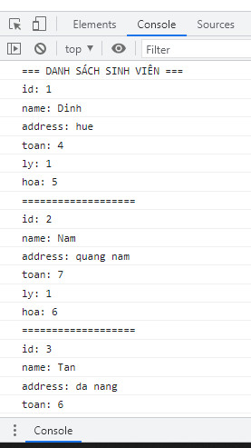

# BÀI TẬP ĐỂ ÁP DỤNG CÁC HÀM forEach, every, some, filter, find, map, reduce:

## Bài 1: Viết chương trình có sử dụng hàm
1. nhập 1 mảng các số nguyên
2. nhân 3 giá trị mỗi phần tử trong mảng (dùng map)
3. xuất mảng mới ra màn hình.
4. tính tổng các phần tử trong mảng (dùng reduce)
5. kiểm tra xem thử có phải tất cả các phần tử đều lớn hơn 5 không? (dùng every)
6. kiểm tra xem thử có phần tử nào lớn hơn 5 không? (dùng some)

## Bài 2: Cho mảng sinh viên gồm các thông tin sau:

```js
var students = [
    {
        id: 1,
        name: "Dinh",
        address: "hue"
    },
    {
        id: 2,
        name: "Nam",
        address: "quang nam"
    },
    {
        id: 3,
        name: "Tan",
        address: "da nang"
    },
    {
        id: 4,
        name: "Hung",
        address: "hue"
    },
    {
        id: 5,
        name: "Tri",
        address: "quang tri"
    },
    {
        id: 6,
        name: "Anh",
        address: "hue"
    },
    {
        id: 7,
        name: "Binh",
        address: "da nang"
    }
];
```

- Thêm các thuộc tính điểm Toán, điểm Lý, điểm Hóa để lưu thông tin điểm thi cho các sinh viên là các số ngẫu nhiên từ 0 đến 10
    + Cách 1: Dùng forEach
    + Cách 2: Dùng map
    + so sánh forEach và map
- Hiển thị các sinh viên trong danh sách như sau:



## Bài 3: Cho mảng sinh viên như sau:

```js
const students = [
    {
        id: 1,
        name: "Dinh",
        toan: 5,
        ly: 6,
        hoa: 7
    },
    {
        id: 2,
        name: "Nam",
        toan: 10,
        ly: 8,
        hoa: 5,
    },
    {
        id: 3,
        name: "Tan",
        toan: 3,
        ly: 5,
        hoa: 5,
    },
    {
        id: 4,
        name: "Hung",
        toan: 9,
        ly: 7,
        hoa: 7,
    },
    {
        id: 5,
        name: "Tri",
        toan: 9,
        ly: 8,
        hoa: 9,
    },
    {
        id: 6,
        name: "Anh",
        toan: 9,
        ly: 10,
        hoa: 9,
    },
    {
        id: 7,
        name: "Binh",
        toan: 3,
        ly: 6,
        hoa: 9,
    }
];
```

Tạo menu như sau:
=== QUẢN LÝ SINH VIÊN ===
1. kiểm tra xem có phải tất cả sinh viên đều có các môn trên điểm trung bình không?
2. kiểm tra xem có sinh viên nào xếp loại giỏi không?
3. Lọc ra các sinh viên xếp loại giỏi
4. Tìm 1 sinh viên xếp loại giỏi
5. Cộng cho mỗi sinh viên 1 điểm toán
6. Thêm thuộc tính tổng điểm 3 môn
7. Tính tổng điểm của tất cả các sinh viên
8. Sắp xếp danh sách sinh viên theo tổng điểm tăng dần
9. Thoát
---------------------------------------

- Khi chọn 1: Duyệt mảng và kiểm tra xem có phải tất cả sinh viên đều có các môn trên điểm trung bình không?
- Khi chọn 2: Duyệt mảng và kiểm tra xem có sinh viên nào xếp loại giỏi không?
- Khi chọn 3: Lọc ra các sinh viên xếp loại giỏi và in ra
- Khi chọn 4: Tìm 1 sinh viên xếp loại giỏi và hiển thị
- Khi chọn 5: Cộng cho mỗi sinh viên 1 điểm toán
- Khi chọn 6: Thêm thuộc tính sum để lưu tổng điểm 3 môn
- Khi chọn 7: Tính tổng điểm của tất cả các sinh viên
- Khi chọn 8: Sắp xếp danh sách sinh viên theo tổng điểm tăng dần
- Khi chọn 9: Thoát khỏi hệ thống và in ra dòng chữ: "Goodbye!"