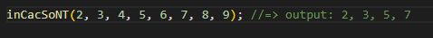

## Bài 1: Viết chương trình (có sử dụng hàm) giải phương trình bậc 1: ax + b = 0 (xét tất cả các trường hợp).

## Bài 2: Viết chương trình (có sử dụng hàm) giải phương trình bậc 2: ax^2 + bx + c = 0 (xét tất cả các trường hợp).

## Bài 3: Tạo menu như sau:
---------------------------------------
== GIẢI PHƯƠNG TRÌNH ==
1. BẬC 1
2. BẬC 2
3. THOÁT
---------------------------------------

- Khi chọn 1: Gọi hàm giải phương trình bậc 1
- Khi chọn 2: Gọi hàm giải phương trình bậc 2
- Khi chọn 3: Thoát khỏi chương trình và in ra dòng chữ "Good Bye!"

## Bài 4: Tạo menu như sau:
---------------------------------------
== CHỌN CHỨC NĂNG ==
1. In dãy số
2. Tính tổng
3. Tìm số lớn nhất
4. Tìm số nhỏ nhất
5. Thoát
---------------------------------------
    + chương trình sử dụng hàm truyền vào một dãy số
    + Sử dụng đối tượng arguments
    + Thực hiện các chức năng sau:

- Khi chọn 1: Gọi hàm in dãy số đã nhập
- Khi chọn 2: Gọi hàm tính tổng của dãy số
- Khi chọn 3: Gọi hàm tìm số lớn nhất
- Khi chọn 4: Gọi hàm tìm số nhỏ nhất
- Khi chọn 5: Thoát khỏi chương trình và in ra dòng chữ "Good Bye!"

## Bài 5: Viết chương trình (có sử dụng hàm) kiểm tra xem 1 số có phải là số nguyên tố không?
## Bài 6: Viết chương trình (có sử dụng hàm) kiểm tra xem 1 số có phải là số hoàn hảo không?

## Bài 7: Viết chương trình có sử dụng hàm nhận vào 1 dãy số => in ra các số nguyên tố trong dãy đó
